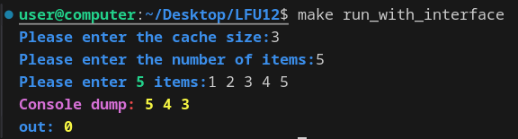
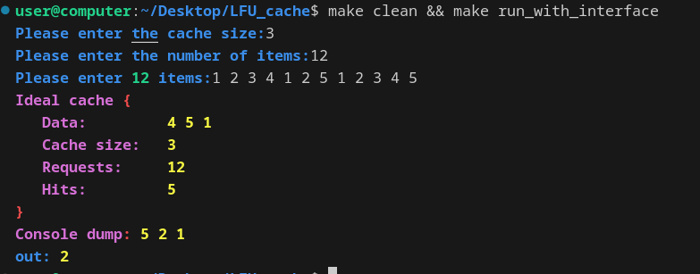

<div align="center">
  
  # Реализация алгоритма кеширования LFU на языке С++
    
</div>

## Другие языки

1. [Russian](/README.md)
2. [English](/README-en.md)

## Установка и сборка:

Для установки, компиляции и запуска без интерфейса введите:
```cpp
git clone https://github.com/BulgakovDmitry/LFU_cache
cd LFU_cache
make make run_LFU
```
Для компиляции и запуска c интерфейсом (с флагом “--interface”) замените make make run_LFU на
```cpp
make run_LFU_with_interface
```

Программа также имеет встроенную систему тестирования, которая при ошибке выдает подробные логи с информацией.

Для запуска встроенных тестов введите:
```cpp
make test
```

Для просмотра основных целей makefile с кратким описанием введите:
```cpp
make help
```

## Важно
В программе реализован графический дамп при помощи graphviz.

Для быстрой его установки на линукс в командной строке введите:
```bash
sudo apt update
sudo apt install graphviz
```

## Немного о дампе
При помощи graphviz мы можем получить понятную и удобную информацию о состоянии кеша и проследить за его изменением при обращении к элементам. Посмотрим в качестве примера, как кешируются элементы типа int:

<div align="center">
  
</div>

Графический дамп генерирует следующее изображение:

<div align="center">
  
</div>

Также реализованы различные консольные дампы, дающие информацию о состоянии кеша в удобном для дебага формате (в зависимости от текущего объекта дебага).
```cpp
template<typename KeyType, typename ValueType>
void        consoleDump           (const LFU<KeyType, ValueType>& cache);

template<typename KeyType, typename ValueType>
void        consoleGeneralizedDump(const LFU<KeyType, ValueType>& cache);

template<typename KeyType, typename ValueType>
void        consoleFullDump       (const std::vector<ValueType>& vec, std::size_t cacheSize);

template<typename KeyType, typename ValueType>
void        graphDump             (const std::vector<ValueType>& vec, std::size_t cacheSize);
```

## Обзор
Определение класса кеша:
```cpp
template<typename KeyType, typename ValueType> 
class LFU {
public:
    // methods
private:
    std::size_t                              cacheSize_;
    Tick_t                                   tick_;
    std::list<CacheCell<KeyType, ValueType>> data_;
    std::size_t                              numberOfHits_;
    std::unordered_map<
        KeyType, 
        ListIt>                              hashTable_;

    std::map<Metric_t, KeyType, MetricComp>  cacheFic_;
    std::unordered_map<KeyType, Metric_t>    keyToMetric_;
};
```
Тут определение ячейки кеша имеет следующий вид:
```cpp
template<typename KeyType, typename ValueType> 
struct CacheCell {
    KeyType     key;
    ValueType   value;

    std::size_t numberOfRequests;
    Tick_t      lastAccessedTime;

    bool        emptyFlag;
};
```

Некоторые базовые детали для понимания алгоритма кеширования:

| переменная       | значение                        |
|-------------------------|-----------------------------------|
| `cacheSize`             | число кеш-ячеей в текущем кеше     |
| `tick`             | глобальная переменная кеша, характеризующая время работы алгоритма (в единицах количества обращений)       |
| `data`        | Список кеш-ячеек с данными |
| `key`        | ключ кешируемого значения   |
| `value`      | кешируемое значение      |
| `numberOfRequests`      | количество обращений к текущей кеш-ячейке       |
| `lastAccessedTime`      | время последнего вызова в единицах, характеризующих время работы кеша        |
| `emptyFlag`      | специальный флаг, который определяет, свободна ли текущая ячейка кэша       |
| `numberOfHits` | количество попаданий в кеш |
| `hashTable` | хеш-таблица для быстрого поиска элемента по ключу |

## Сравнение выбранного алгоритма кеширование с идеальным
Чтобы было с чем сравнивать эффективность реализованного алгоритма кеширования LFU создан идеальный алгоритм кеширования, который "знает будущее".
Для него создан удобный dump для быстрого и удобного получения информации о значениях в кеше и кеш хитах.
<div align="center">
  
</div>
Как мы можем заметить, при одном наборе данных наш алгоритм показывает 2 кеш попадания, в то время как идеальный алгоритм кеширования "ловит" 5 попаданий.

 

## Структура проекта
```
LFU_cache/
├── headers/            # Header files
├── src/                # Source code
│
├── tests/              # built-in program testing
│   ├── src/            # test source code
│   └── headers/        # test header files
│
├── graphDump/          # for images and graphviz files
│
├── build/              # Project build folder
│   ├── obj/            # object files
│   └── bin/            # executable files
│
├── common/             # common files 
│
└── Makefile/           # Makefile           
```

